<p align="center">
  
</p>

<h1 align="center">Comfort</h1>

Comfort is a personal, free and open-source video/gallery/music downloader for Android 7.0 and
above, built on top of [gallery-dl](https://github.com/mikf/gallery-dl),
[yt-dlp](https://github.com/yt-dlp/yt-dlp) and [Instaloader](https://github.com/instaloader/instaloader),
with added Spotify link support. Paste a link, or share one in from any app, and download the
video, gallery, or song behind it with real quality, format, and trim control.

Package: `com.comfort.app` · minSdk 24 · targetSdk 36 · Jetpack Compose (Material 3 Expressive)

<p align="center">
  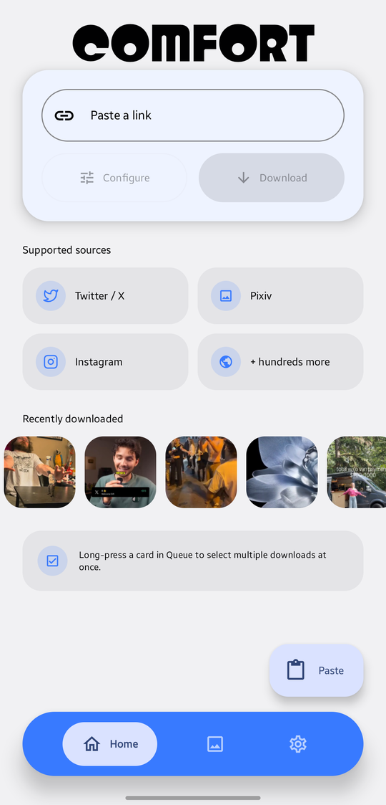&nbsp;
  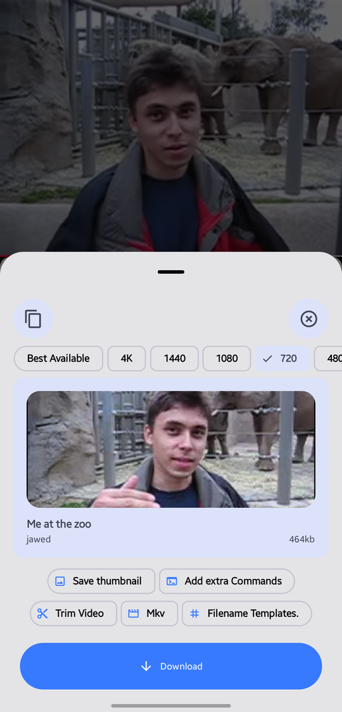&nbsp;
  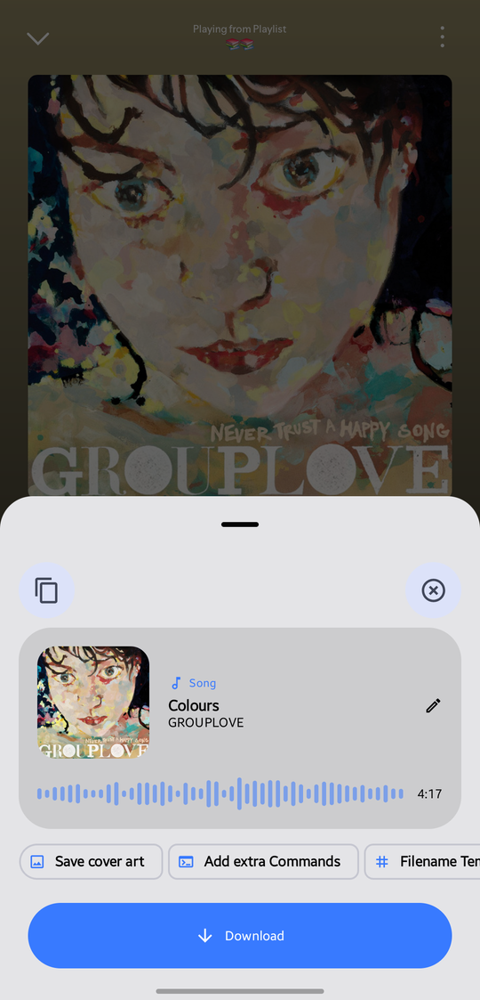&nbsp;
  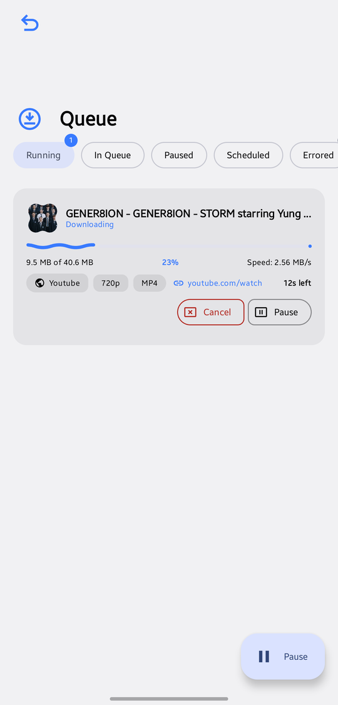
</p>

## See it work

<table>
  <tr>
    <td align="center">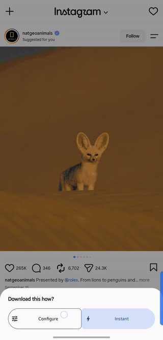</td>
    <td align="center">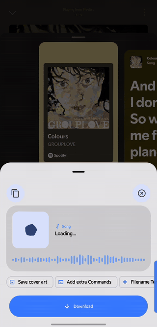</td>
  </tr>
  <tr>
    <td align="center">Share an Instagram carousel, pick the items, download</td>
    <td align="center">Share a Spotify song, check the details, download</td>
  </tr>
</table>

## Features

📥 **Downloading**
- Paste a link on Home, or share one in from any app. **Configure** opens the preview sheet,
  **Instant** starts downloading right away, and the Sharing mode setting picks one for you or
  asks each time
- Automatic engine routing per URL — gallery-dl for image/gallery sites, yt-dlp for video hosts,
  Instaloader for Instagram — with a same-item fallback/supplement pass between them whenever one
  comes back empty (an Instagram carousel's embedded video that gallery-dl's own listing missed,
  for example). A live, no-network probe against the bundled engines skips that fallback when a
  link is exclusive to one engine, instead of always attempting both
- Content detection: a link that resolves to video (from *any* site, not a fixed host list) or a
  song opens the preview sheet; a real multi-item gallery shows an item picker to choose which
  files to grab
- Queue with pause/resume/cancel, configurable concurrent downloads, "Up next" to move a download to
  the front of the line, and a scheduled download window (only download overnight, say)
- Live speed and progress, a stall watchdog, and automatic retries on flaky connections
- Resumable in-progress downloads survive process death — a killed app picks a download back up
  instead of restarting it
- yt-dlp, gallery-dl and Instaloader update independently of the app itself, on a Stable or
  Bleeding Edge channel per engine, from Settings — no need to wait for a new app release to pick up
  a site-extractor fix

🎵 **Music**
- Spotify track/album/playlist links — no API key or login needed. Scrapes Spotify's own public
  embed pages for real title/artist/album/cover art, matches the track on YouTube, and tags the
  downloaded audio with Spotify's metadata instead of whatever the matched video reports
- A song preview for Spotify/YouTube Music/SoundCloud links (and any link where you pick "Audio"
  quality): cover art, duration, and an editable title/artist pre-filled with upload clutter
  ("Official Video", "Lyrics", a channel's own auto-added "- Topic" suffix, ...) already stripped.
  An album/playlist link shows the album and every track with its own checkbox instead of
  downloading blind
- Real artist/album metadata is captured into the app's own library (not just embedded in the
  file) — Library has a dedicated Audio filter, and a track's card shows "Artist — Album" instead
  of just the source domain
- A YouTube Music download's cover art is looked up against iTunes' public catalog and swapped in
  for YouTube's own 16:9 video-frame thumbnail

🎛️ **Per-download options** (the preview sheet)
- Video quality: Best / 4K / 1440p / 1080p / 720p / 480p / Audio-only, showing the size of the
  quality you pick before you download
- Clip/section trimming — multi-segment, Set Start/Set End against the real video position
- MP4 or MKV output
- Save thumbnail, embed metadata/subtitles, write description/info.json sidecar files
- Extra command-line arguments — one set for both engines plus separate yt-dlp and gallery-dl sets,
  with a switch to turn them all off — and saved, reusable filename templates

🛡️ **Sites & reliability**
- Cookie import via an in-app login browser — logs in normally, then converts the session to a
  real Netscape `cookies.txt` automatically — with per-site management
- Bot-detection bypass (`curl_cffi` browser impersonation) for TikTok, Reddit share links, and
  others
- Proxy support, configurable network retries, and extractor arguments for site-specific
  throttling workarounds
- Readable errors — each engine's own error for a failed download, and a blocked request's raw
  HTML/CSS blob never reaches the UI as-is

🎨 **App**
- Library with search, filters, favorites, duplicates, and a grid/list view toggle
- Light/dark/system theme, several named color themes, dynamic color, and a pure-black OLED option

## Screenshots

<table>
  <tr>
    <td align="center">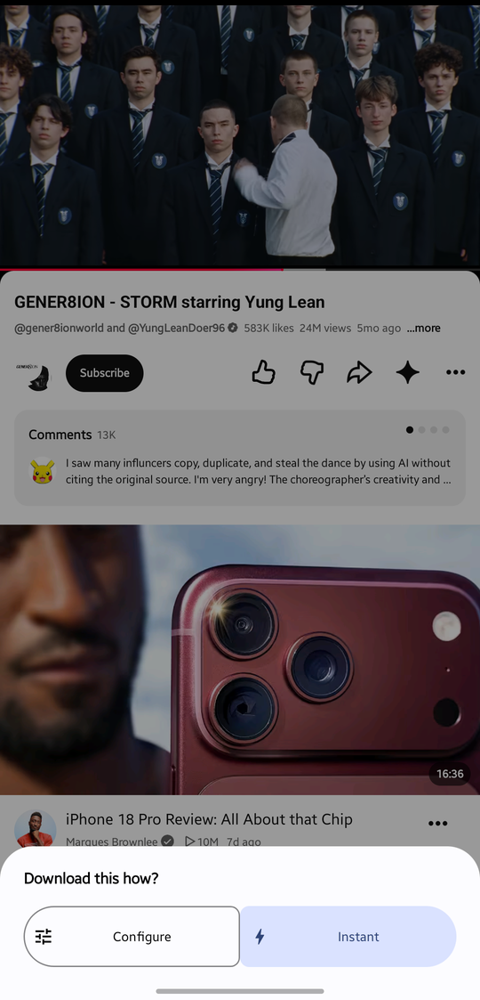<br>Configure or Instant</td>
    <td align="center">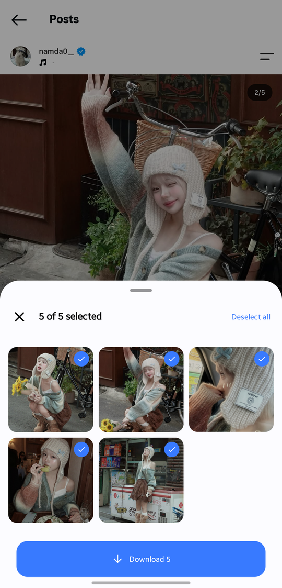<br>Gallery picker</td>
    <td align="center">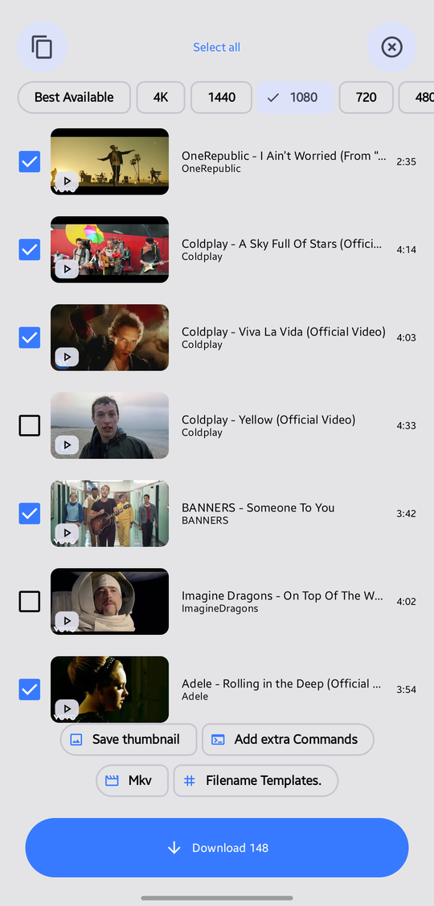<br>Playlist</td>
    <td align="center">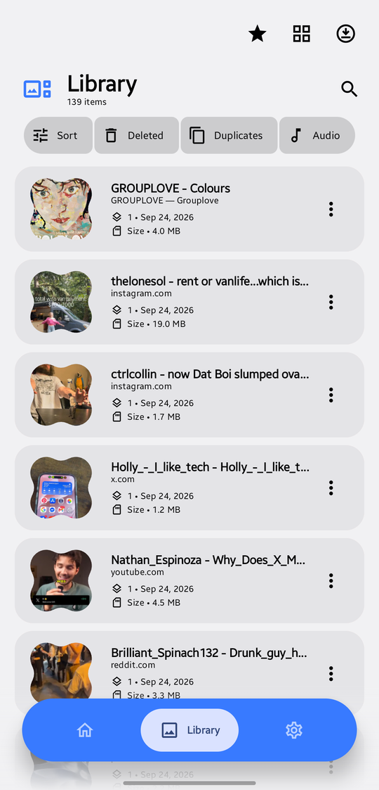<br>Library</td>
  </tr>
  <tr>
    <td align="center">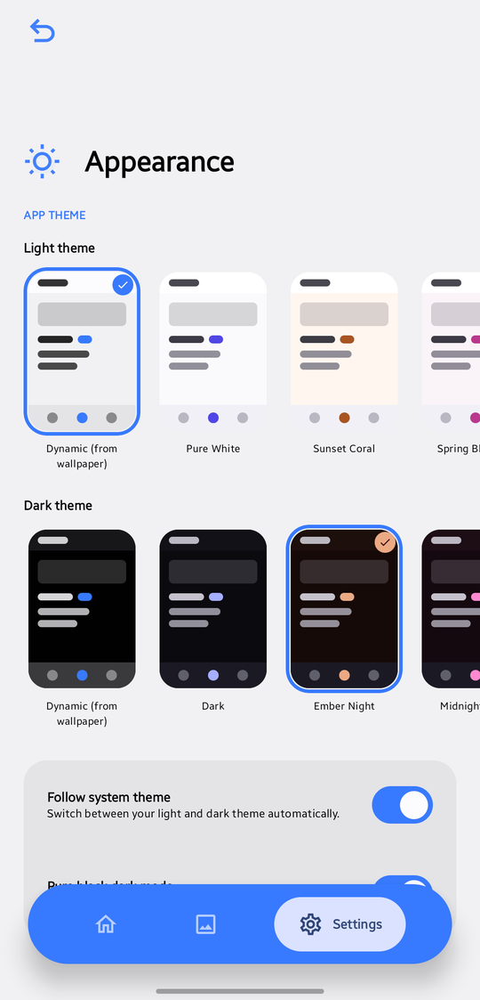<br>Appearance</td>
    <td align="center">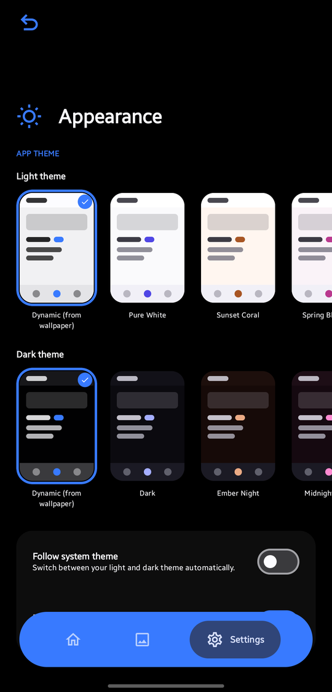<br>Pure black</td>
    <td align="center">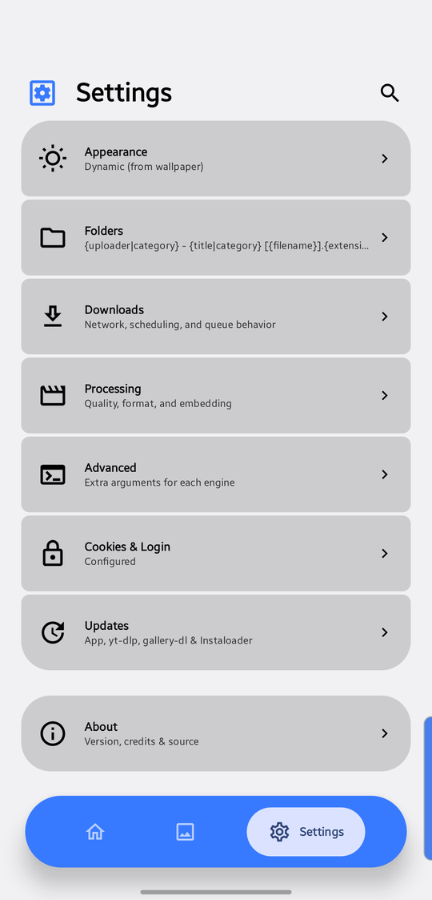<br>Settings</td>
    <td align="center">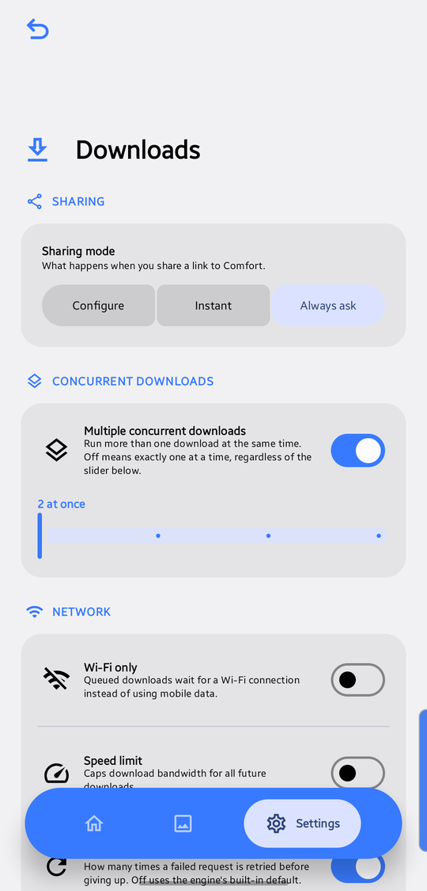<br>Downloads</td>
  </tr>
  <tr>
    <td align="center">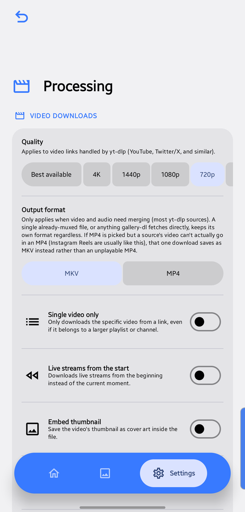<br>Processing</td>
    <td align="center">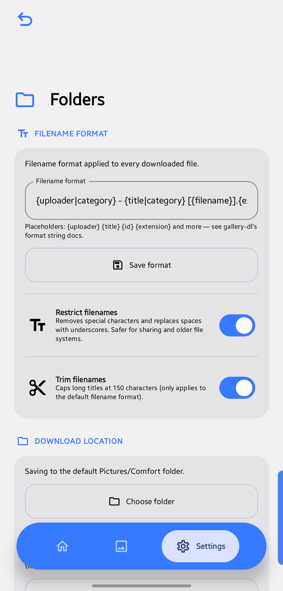<br>Folders</td>
    <td align="center">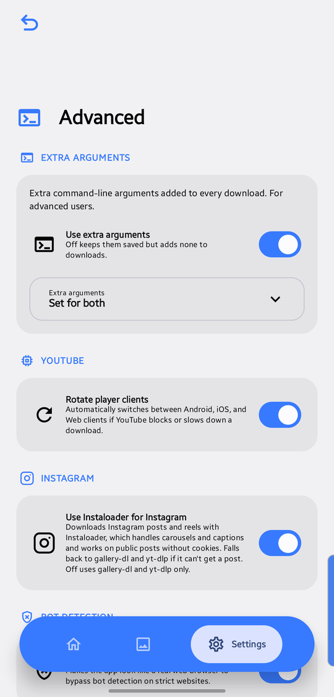<br>Advanced</td>
    <td align="center">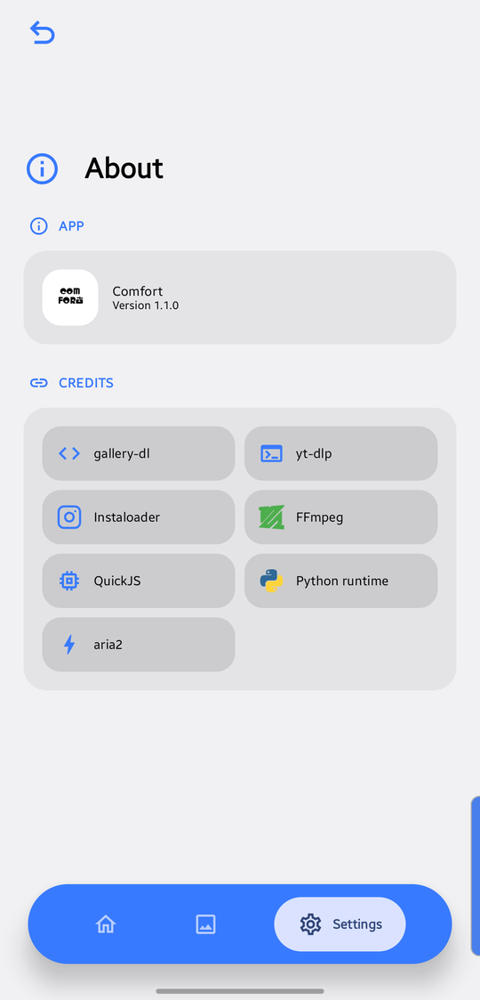<br>About</td>
  </tr>
</table>

## How it works

gallery-dl, yt-dlp and Instaloader (plus a small Spotify wrapper that scrapes Spotify's public
embed pages, then delegates the actual audio download to yt-dlp) run in a real standalone Python
interpreter — a genuine OS process per download, not an embedded JNI interpreter — which is what
makes `curl_cffi` browser impersonation possible on Android at all. A small fork server keeps the
engines pre-loaded so each download starts without paying Python's import cost again. Kotlin talks
to it over a stdout line protocol (`[title]`/`[thumbnail]`/`[progress]`/`[error]`/bare file paths),
the same shape either tool prints when run from a terminal. A bundled `ffmpeg` build handles muxing
and does the post-download stream-copy trim used by the Clip/section feature.

Room + WorkManager persist the download queue across process death; the UI is 100% Jetpack Compose
with Material 3 Expressive components.

## Building

```bash
git clone <this repo>
cd gallerydl
./gradlew :app:assembleDebug
```

Requires the Android SDK (targetSdk 36) and a JDK 17 toolchain. Debug builds install straight from
`app/build/outputs/apk/debug/`.

Ships as per-ABI APKs for `arm64-v8a`, `armeabi-v7a` (kept for real 32-bit-only budget devices,
not just emulators) and `x86_64`, plus a universal APK with all three.

## Credits

- [gallery-dl](https://github.com/mikf/gallery-dl) (GPLv2), [yt-dlp](https://github.com/yt-dlp/yt-dlp)
  (Unlicense) and [Instaloader](https://github.com/instaloader/instaloader) (MIT) — the actual
  download engines this app wraps
- [YTDLnis](https://github.com/deniscerri/ytdlnis) / its
  [ytdlnis-packages](https://github.com/deniscerri/ytdlnis-packages) repo (GPLv3) — the
  subprocess-Python-on-Android architecture this app's own Python runtime is built on, and the
  actual prebuilt Python/ffmpeg/QuickJS binaries bundled directly into this app
- [aria2](https://github.com/aria2/aria2) (GPLv2+) — multi-connection downloads
- [QuickJS](https://github.com/bellard/quickjs) (MIT) — JS-challenge solving for sites that require it
- [TachiyomiJ2K](https://github.com/Jays2Kings/tachiyomiJ2K) (Apache-2.0) — the Appearance
  screen's theme-picker layout (light/dark preview card rows) is ported from its own Settings UI

## License

GPLv3 — see [`LICENSE`](LICENSE). Required by the GPL-licensed components this app bundles
directly (gallery-dl, aria2, and the ytdlnis-packages Python/ffmpeg/QuickJS binaries) — bundling
GPL code into a distributed app means the combined work has to be GPL-compatible too, with source
available to anyone who gets the APK (this repo). The permissively-licensed pieces (yt-dlp,
Instaloader, QuickJS, the ported TachiyomiJ2K UI) are all GPL-compatible on their own terms; see
Credits above for each one's actual license.
